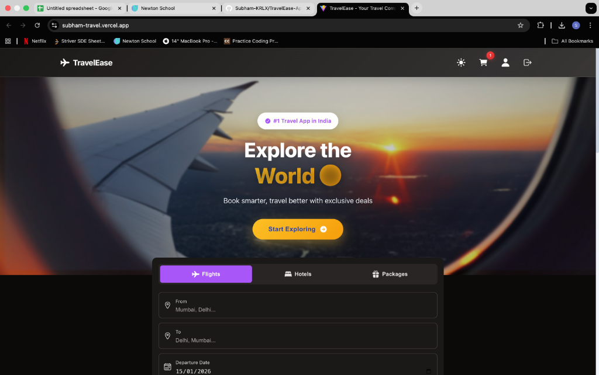
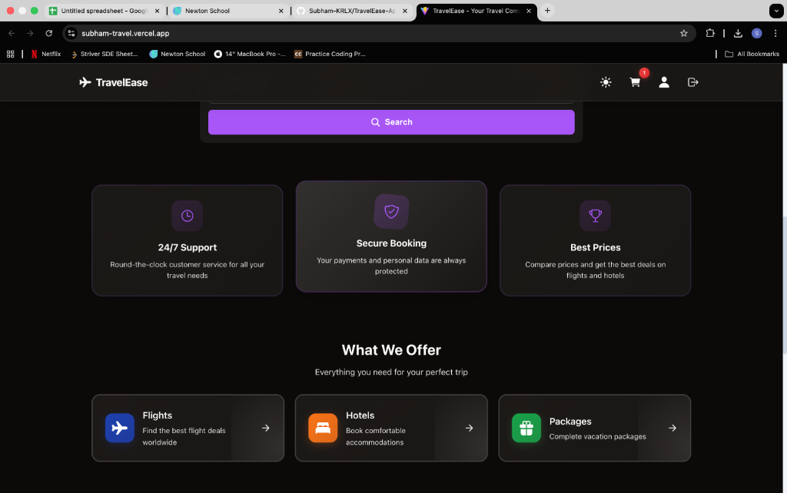
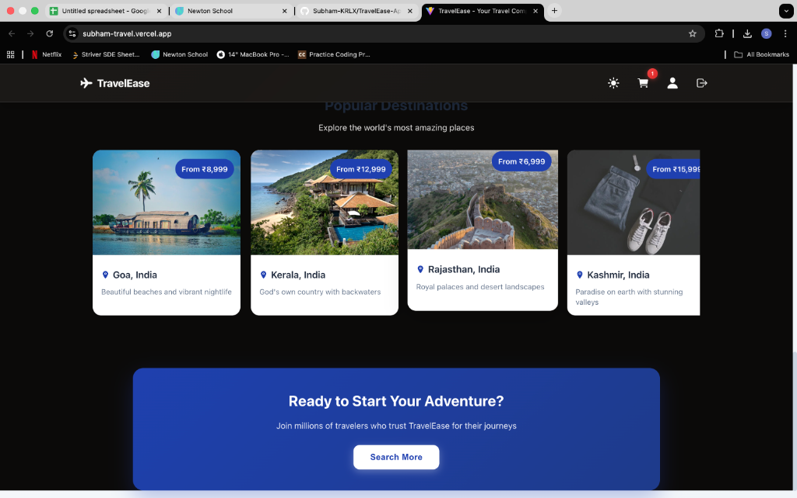
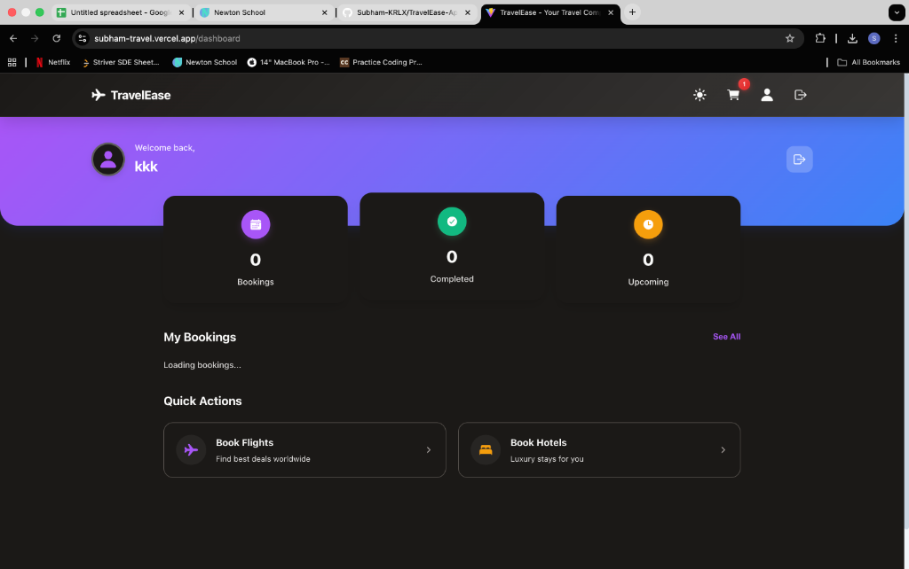
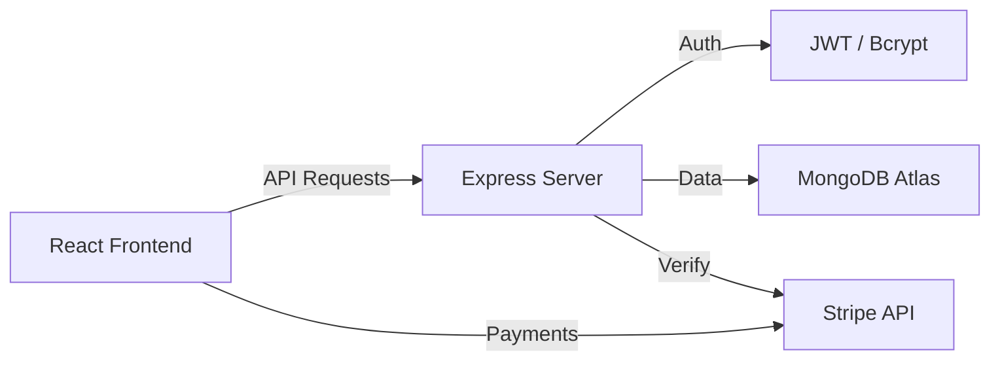

# 🌍 TravelEase - Your Ultimate Travel Companion ✈️

[](https://reactjs.org/)
[](https://nodejs.org/)
[](https://www.mongodb.com/)
[](LICENSE)
[](https://subham-travel.vercel.app)

**TravelEase** is a premium, full-stack travel booking platform designed to provide a seamless experience for finding flights, luxury hotels, and curated vacation packages. Built with a modern aesthetic and robust performance in mind.

---

## 📸 Project Gallery

### 🏠 Immersive Landing Page
A high-converting hero section with an intelligent search interface and dynamic background.



### ✨ Core Services
A minimalist grid showcasing 24/7 support, secure booking, and best price guarantees, followed by our core offerings.



### 🗺️ Popular Destinations
Curated travel recommendations with real-time pricing and beautiful imagery.



### 👤 User Dashboard
A dedicated space for users to track their bookings, view status updates, and manage their profile.



---

## 🚀 Technical Deep Dive

### **Frontend Architecture**
Our frontend is built for speed and responsiveness using **React 19** and **Vite**.

- **Styled Components**: We use CSS-in-JS for truly modular styling, enabling complex glassmorphism effects and consistent theming across the app.
- **React Context API**: Manages global state for Authentication, Cart, and Theme without the boilerplate of Redux.
- **Stripe Integration**: Secure, PCI-compliant payment processing via `@stripe/react-stripe-js`.
- **Axios Interceptors**: Handles base URL configuration and automated token injection for authorized requests.

### **Backend Architecture**
A scalable **Node.js/Express** REST API designed with security and clean code in mind.

- **MongoDB & Mongoose**: Flexible document storage with strictly defined schemas for Flights, Hotels, and Users.
- **JWT Authentication**: Stateless authentication using JSON Web Tokens, secured with **bcryptjs** for password hashing.
- **Security Middleware**: 
  - **Helmet**: Sets various HTTP headers for app security.
  - **CORS**: Configured for secure cross-origin resource sharing between frontend and backend.
  - **Express Validator**: Server-side validation to ensure data integrity.

### **System Workflow**


---

## 📂 Project Structure

```bash
TravelEase-App/
├── frontend/                # React / Vite Application
│   ├── src/
│   │   ├── components/     # Atomic UI components
│   │   ├── pages/          # Navigation-level components
│   │   ├── context/        # Global state management
│   │   └── services/       # API communication layer
│   └── package.json
├── backend/                 # Node.js / Express API
│   ├── controllers/        # Business logic
│   ├── models/             # Database schemas
│   ├── routes/             # API endpoints
│   ├── middleware/         # Auth & Security
│   └── server.js           # Entry point
├── screenshots/             # Visual documentation
└── README.md
```

---

## 🛠️ Getting Started

### 1. Clone & Prep
```bash
git clone https://github.com/Subham-KRLX/TravelEase-App.git
cd TravelEase-App
```

### 2. Configure Environment
Create `.env` files in both `backend` and `frontend` directories using `.env.example` as a template.

> [!IMPORTANT]
> Never share your `.env` files. Both directories' secret files are ignored by Git for your security.

### 3. Installation
```bash
# Install all dependencies (Monorepo helper)
npm run install:all

# Run Backend
cd backend && npm run dev

# Run Frontend
cd frontend && npm run dev
```

---

## 🎯 Key Features

- [x] **Smart Search**: Intelligent filtering for flights and hotels.
- [x] **Secure Auth**: Persistent login with JWT and local storage.
- [x] **Fluid UI**: Glassmorphism design system that feels premium.
- [x] **Dark Mode**: Native support for late-night planning.
- [x] **Stripe Checkout**: Real-world payment flow simulation.
- [x] **Responsive**: Seamless experience from iPhone 12 to Ultra-wide monitors.

---

## 🤝 Contact & Contributing

Created by **Subham Sangwan** - [GitHub](https://github.com/Subham-KRLX)

Feel free to open an issue or submit a pull request if you'd like to contribute!

[Live Demo](https://subham-travel.vercel.app) | [Report Bug](https://github.com/Subham-KRLX/TravelEase-App/issues)
