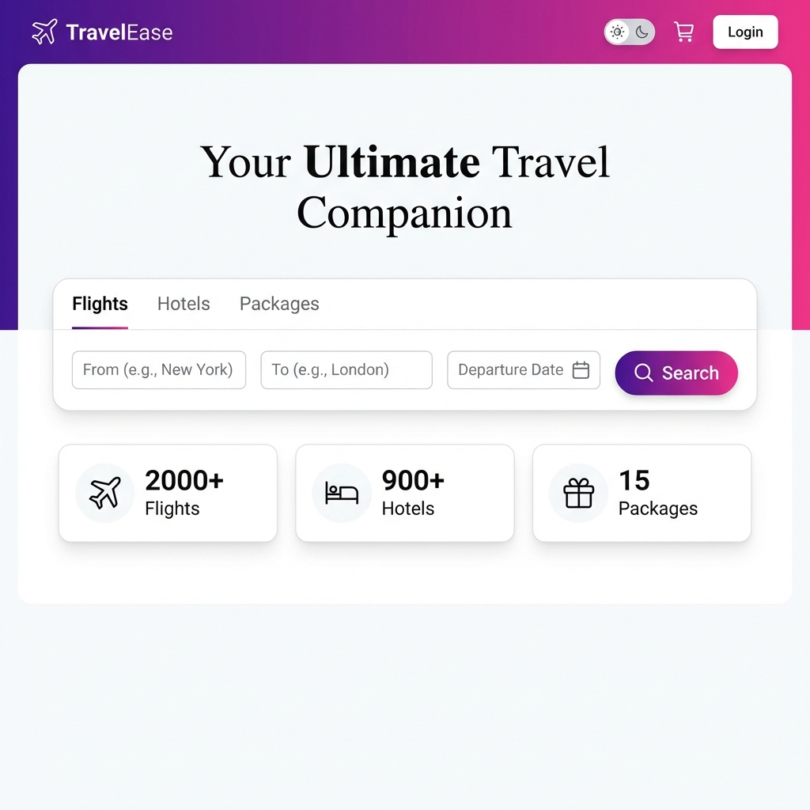
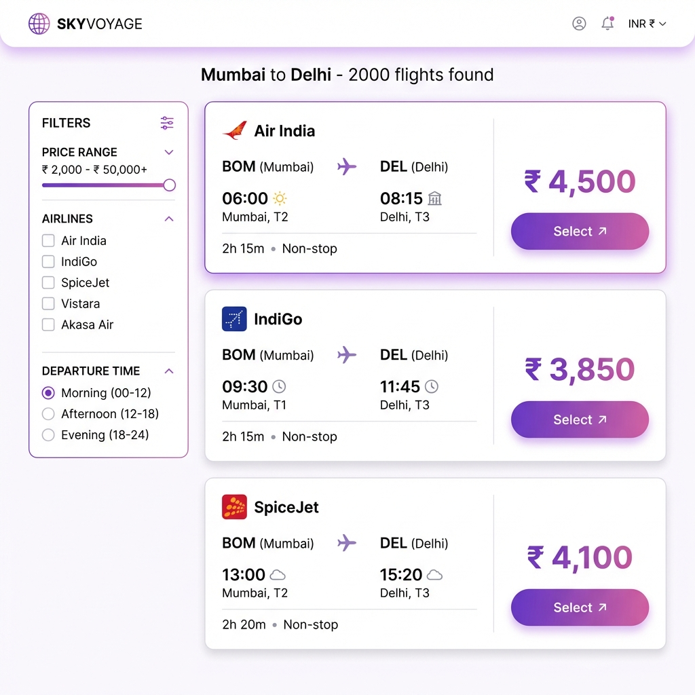

# 🌍 TravelEase - Your Ultimate Travel Companion

[](https://reactjs.org/)
[](https://nodejs.org/)
[](https://www.mongodb.com/)
[](LICENSE)

A modern, full-stack travel booking application with flight, hotel, and package search capabilities. Built with React, Node.js, Express, and MongoDB.


## ✨ Features

### 🎯 Core Functionality
- **Flight Booking** - Search and book flights with real-time availability
- **Hotel Reservations** - Browse and book hotels worldwide
- **Travel Packages** - Complete vacation packages with flights + hotels
- **User Authentication** - Secure login/signup with JWT
- **Shopping Cart** - Add multiple items and checkout seamlessly
- **Payment Integration** - Stripe payment gateway (test mode)
- **User Dashboard** - Track bookings and manage profile

### 📱 User Experience
- **Responsive Design** - Optimized for mobile, tablet, and desktop
- **Dark/Light Mode** - Toggle between themes
- **Real-time Search** - Instant search suggestions
- **Touch-Friendly** - 44px minimum touch targets
- **No Dead Buttons** - Every button leads somewhere useful

### 🎨 Design Highlights
- Modern, premium UI with glassmorphism effects
- Smooth animations and transitions
- Mobile-first responsive approach
- Professional Stripe payment interface
- Clean, intuitive navigation

## 🚀 Tech Stack

### Frontend
- **React 18** - UI framework
- **Vite** - Build tool and dev server
- **Styled Components** - CSS-in-JS styling
- **React Router DOM** - Client-side routing
- **Stripe.js** - Payment processing
- **Axios** - HTTP client
- **React Icons** - Icon library

### Backend
- **Node.js** - Runtime environment
- **Express.js** - Web framework
- **MongoDB** - Database
- **Mongoose** - ODM
- **JWT** - Authentication
- **Bcrypt** - Password hashing
- **Helmet** - Security middleware
- **Morgan** - HTTP logging

## 📁 Project Structure

```
# TravelEase App 🚀
TravelEase-App/
├── frontend/                # React frontend
│   ├── src/
│   │   ├── components/     # Reusable components
│   │   │   ├── Header.jsx
│   │   │   └── SearchBar.jsx
│   │   ├── pages/          # Page components
│   │   │   ├── HomeScreen.jsx
│   │   │   ├── SearchResultsScreen.jsx
│   │   │   ├── CheckoutScreen.jsx
│   │   │   ├── PaymentScreen.jsx
│   │   │   └── DashboardScreen.jsx
│   │   ├── context/        # React Context
│   │   │   ├── AuthContext.jsx
│   │   │   ├── CartContext.jsx
│   │   │   └── ThemeContext.jsx
│   │   ├── services/       # API services
│   │   └── config/         # Configuration
│   └── package.json
├── backend/                 # Node.js backend
│   ├── controllers/        # Route controllers
│   ├── models/             # Mongoose models
│   ├── routes/             # API routes
│   ├── middleware/         # Custom middleware
│   ├── config/             # Server config
│   └── server.js
└── README.md
```

## 🛠️ Installation & Setup

### Prerequisites
- Node.js 18.x or higher
- MongoDB 6.x or higher
- npm or yarn

### 1. Clone the Repository
```bash
git clone https://github.com/Subham-KRLX/TravelEase-App.git
cd TravelEase-App
```

### 2. Backend Setup
```bash
cd backend
npm install

# Create .env file
cat > .env << EOF
PORT=5001
MONGODB_URI=mongodb://localhost:27017/travelease
JWT_SECRET=your_jwt_secret_key_here
NODE_ENV=development
EOF

# Start backend server
npm run dev
```

### 3. Frontend Setup
```bash
cd ../frontend
npm install

# Create .env file (optional)
cat > .env << EOF
VITE_API_URL=http://localhost:5001/api
VITE_STRIPE_PUBLISHABLE_KEY=pk_test_your_stripe_key
EOF

# Start frontend dev server
npm run dev
```

### 4. Access the Application
- Frontend: http://localhost:5173
- Backend API: http://localhost:5001/api

## 🔑 Environment Variables

### Backend (.env)
```env
PORT=5001
MONGODB_URI=mongodb://localhost:27017/travelease
JWT_SECRET=your_super_secret_jwt_key
NODE_ENV=development
```

### Frontend (.env)
```env
VITE_API_URL=http://localhost:5001/api
VITE_STRIPE_PUBLISHABLE_KEY=pk_test_your_stripe_publishable_key
```

## 📱 Responsive Breakpoints

```css
/* Mobile First */
Default: < 640px (Mobile phones)
@media (min-width: 640px): Tablets
@media (min-width: 1024px): Desktops
```

**Tested Devices:**
- ✅ iPhone SE (375px)
- ✅ iPhone 12/13 (390px)
- ✅ iPhone Pro Max (428px)
- ✅ Standard Android (360-412px)
- ✅ iPad (768px)
- ✅ Desktop (1280px+)

## 🧪 Testing

### Stripe Test Cards
Use these card numbers for testing payments:

```
Success: 4242 4242 4242 4242
Decline: 4000 0000 0000 0002
```
- **Expiry**: Any future date
- **CVC**: Any 3 digits
- **ZIP**: Any 5 digits

## 🎯 Key Features Implementation

### ✅ Completed Features
- [x] User authentication (Login/Signup)
- [x] Flight search with filters
- [x] Hotel search with date selection
- [x] Package browsing
- [x] Shopping cart functionality
- [x] Checkout system with price calculation
- [x] Stripe payment integration
- [x] User dashboard
- [x] Mobile responsive design
- [x] Dark/Light theme toggle
- [x] Search suggestions

### 🔄 Upcoming Features
- [ ] Booking confirmation emails
- [ ] User booking history
- [ ] Advanced filters (price range, ratings)
- [ ] Reviews and ratings
- [ ] Admin panel
- [ ] Multi-language support

## 🤝 Contributing

Contributions are welcome! Please feel free to submit a Pull Request.

1. Fork the Project
2. Create your Feature Branch (`git checkout -b feature/AmazingFeature`)
3. Commit your Changes (`git commit -m 'Add some AmazingFeature'`)
4. Push to the Branch (`git push origin feature/AmazingFeature`)
5. Open a Pull Request

## 📝 License

This project is licensed under the MIT License - see the [LICENSE](LICENSE) file for details.

## 👤 Author

**Subham Sangwan**
- GitHub: [@Subham-KRLX](https://github.com/Subham-KRLX)
- Repository: [TravelEase-App](https://github.com/Subham-KRLX/TravelEase-App)

## 🙏 Acknowledgments

- React team for the amazing framework
- MongoDB team for the robust database
- Stripe for payment processing
- All open-source contributors

## 📸 Screenshots

### 🏠 Home Page
Beautiful landing page with hero section and intelligent search bar.



### ✈️ Flight Search Results
Professional grid layout with real-time flight cards and smart filters.



---

**Built with ❤️ by Subham Sangwan** | [Live Demo](https://subham-travel.vercel.app) | [Report Bug](https://github.com/Subham-KRLX/TravelEase-App/issues)
